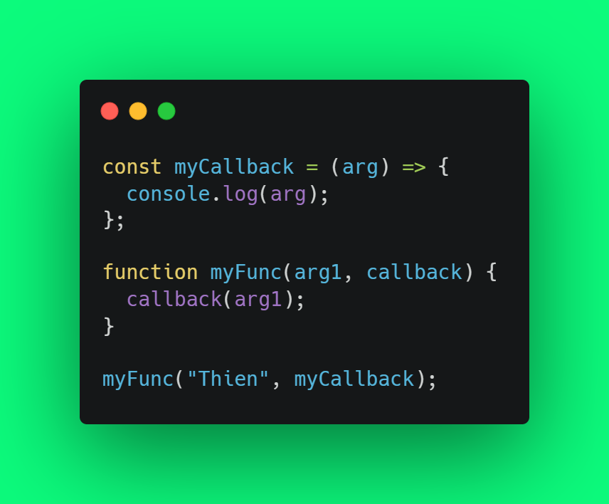
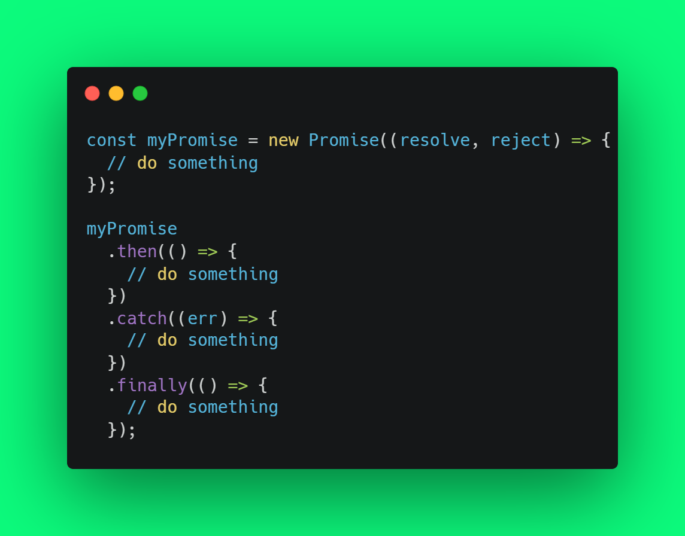
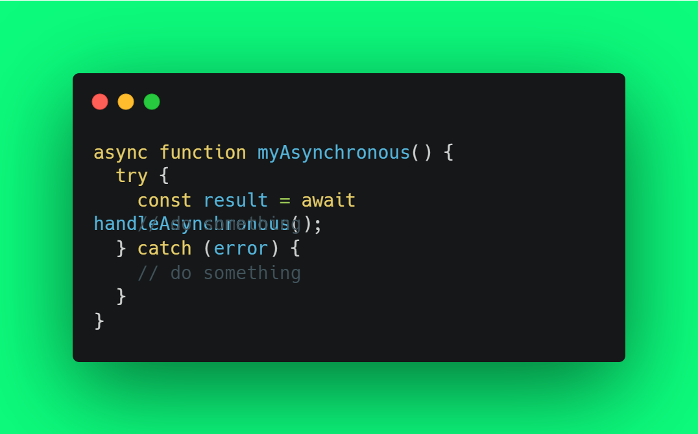
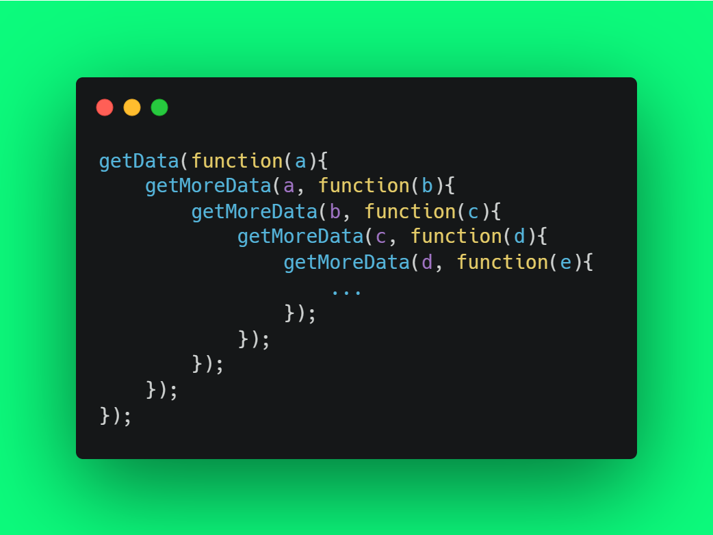

Tên: Nguyễn Thành Thiện

<b>Câu 1: Phân biệt settimeout và setinterval?</b>
Trả lời:

- Giống nhau:
  - Hai hàm cho phép thực hiện công việc nào đó tại một thời điểm được chỉ định ở tương lai , chúng được gọi là “Scheduling a call”.
  - Cả 2 hàm đều là hàm bất đồng bộ.
  - Hai hàm này không phải là một phần của javascript. Nhưng các môi trường chạy Javascript đều có bộ lập lịch nội nên cung cấp các hàm này.
- Khác nhau:

|           | setTimeout                                                                                                                                                                                                                                  | setInterval                                                                                                                                                                                                                                 |
| :-------- | :------------------------------------------------------------------------------------------------------------------------------------------------------------------------------------------------------------------------------------------ | :------------------------------------------------------------------------------------------------------------------------------------------------------------------------------------------------------------------------------------------ |
| Cú pháp   | setTimeout( function , timeout)                                                                                                                                                                                                             | setTimeout( function , timeout)                                                                                                                                                                                                             |
| Công dụng | Công dụng Thực hiện một công việc (function) một lần sau một khoảng thời gian (timeout). Thực hiện một công việc (function) lặp đi lặp lại, sau một khoảng thời gian (interval) và lặp lại liên tục công việc đó trong khoảng thời gian đó. | Công dụng Thực hiện một công việc (function) một lần sau một khoảng thời gian (timeout). Thực hiện một công việc (function) lặp đi lặp lại, sau một khoảng thời gian (interval) và lặp lại liên tục công việc đó trong khoảng thời gian đó. |
| Dừng hàm  | let timerId = setTimeout(...); clearTimeout( timerId );                                                                                                                                                                                | let timerId = setInterval(...); clearInterval( timerId );                                                                                                                                                                              |

<b>Câu 2: Phân biệt callback, promise, async await</b>
Trả lời:

- Giống nhau:
  - Đều có chức năng là xử lý các bất động bộ.
- Khác nhau: 
    - Callback: 
        - Là một hàm được truyền dưới dạng tham số vào hàm khác, và được gọi trong hàm đó.  
        - Cách dùng:
        - 

            
        

        - Promise:
            - Xuất hiện từ ES6, promise giải quyết vấn đề của callback hell.
            - Promise đại diện cho một giá trị nào đó chưa tồn tại ở hiện tại nhưng sẽ có giá trị ở tương lai. Giúp xử lý các bất đồng bộ trông đồng bộ hơn.
            - truyền vào promise một hàm callback và  nhận 2 tham số dạng hàm là resolve, reject.
            - Nếu thực hiện công việc thành công hàm resolve được goi. Ngược lại, thất bại hàm reject được gọi.
            - Promise có 3 trạng thái:
                -	Pending: quá trình thực hiện công việc bất đồng bộ đang được xử lý, chưa có kết quả.
                -	Fulfilled: quá trình thực hiện hoàn thành vào trả về giá trị.
                -	Rejected: quá trình thực hiện bị lỗi. kết quả là một đối tượng error.
            -	Để sử dụng promise khi kết quả trả về:
                -	.then(): khi promise trả về resolve.
                -	.catch(): khi promise trả về reject.
                -	.finally(): được thực hiện dù có resolve hay reject.

    

    -	Async / Await: 
        -	Giúp cho cú pháp promise không dễ mình hơn, giống với quá trình đồng bộ và tránh tình trạng chain .then().
        -	Đặt async trước function để thông báo, đây là hàm xử lý bất đồng bộ.
        -	Await được dừng để báo muốn đợi kết quả của công việc bất động bộ. Await phải được dừng trong hàm có đánh dấu từ khóa async.
        -	Sử dụng try/catch để bắt lỗi xảy ra trong async/await.

    

<!-- <b>Câu 3: Callback hell là gì</b>
Trả lời:
    -	Để xử lý các tác vụ bất động động ta có thể sử dụng callback. Nhưng khi lạm dụng quá nhiều callback lồng nhau sẽ sinh ra callback hell.

    

    - callback-hell -->