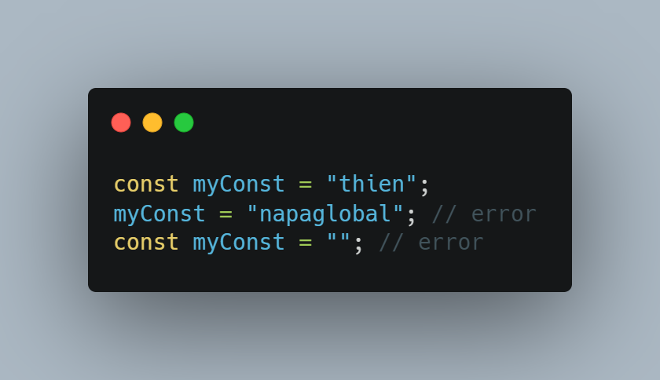

Tên: Nguyễn Thành Thiện

<b>Câu 1: Phân biệt settimeout và setinterval?</b> 
Trả lời:

- Giống nhau:
  - Hai hàm cho phép thực hiện công việc nào đó tại một thời điểm được chỉ định ở tương lai , chúng được gọi là “Scheduling a call”.
  - Cả 2 hàm đều là hàm bất đồng bộ.
  - Hai hàm này không phải là một phần của javascript. Nhưng các môi trường chạy Javascript đều có bộ lập lịch nội nên cung cấp các hàm này.
- Khác nhau:

|           | setTimeout                                                                                                                                                                                                                                  | setInterval                                                                                                                                                                                                                                 |
| :-------- | :------------------------------------------------------------------------------------------------------------------------------------------------------------------------------------------------------------------------------------------ | :------------------------------------------------------------------------------------------------------------------------------------------------------------------------------------------------------------------------------------------ |
| Cú pháp   | setTimeout( function , timeout)                                                                                                                                                                                                             | setTimeout( function , timeout)                                                                                                                                                                                                             |
| Công dụng | Công dụng Thực hiện một công việc (function) một lần sau một khoảng thời gian (timeout). Thực hiện một công việc (function) lặp đi lặp lại, sau một khoảng thời gian (interval) và lặp lại liên tục công việc đó trong khoảng thời gian đó. | Công dụng Thực hiện một công việc (function) một lần sau một khoảng thời gian (timeout). Thực hiện một công việc (function) lặp đi lặp lại, sau một khoảng thời gian (interval) và lặp lại liên tục công việc đó trong khoảng thời gian đó. |
| Dừng hàm  | let timerId = setTimeout(...); clearTimeout( timerId );                                                                                                                                                                                | let timerId = setInterval(...); clearInterval( timerId );                                                                                                                                                                              |

<b>Câu 2: Phân biệt callback, promise, async await</b> 
Trả lời:

- Giống nhau:
  - Đều có chức năng là xử lý các bất động bộ.
- Khác nhau: 
    - Callback: 
        - Là một hàm được truyền dưới dạng tham số vào hàm khác, và được gọi trong hàm đó.  
        - Cách dùng: 
            
        - Promise:
            - Xuất hiện từ ES6, promise giải quyết vấn đề của callback hell.
            - Promise đại diện cho một giá trị nào đó chưa tồn tại ở hiện tại nhưng sẽ có giá trị ở tương lai. Giúp xử lý các bất đồng bộ trông đồng bộ hơn.
            - truyền vào promise một hàm callback và  nhận 2 tham số dạng hàm là resolve, reject.
            - Nếu thực hiện công việc thành công hàm resolve được goi. Ngược lại, thất bại hàm reject được gọi.
            - Promise có 3 trạng thái:
                - Pending: quá trình thực hiện công việc bất đồng bộ đang được xử lý, chưa có kết quả.
                - Fulfilled: quá trình thực hiện hoàn thành vào trả về giá trị.
                - Rejected: quá trình thực hiện bị lỗi. kết quả là một đối tượng error.
            - Để sử dụng promise khi kết quả trả về:
                - .then(): khi promise trả về resolve.
                - .catch(): khi promise trả về reject.
                - .finally(): được thực hiện dù có resolve hay reject.  
    - Async / Await: 
        - Giúp cho cú pháp promise không dễ mình hơn, giống với quá trình đồng bộ và tránh tình trạng chain .then().
        - Đặt async trước function để thông báo, đây là hàm xử lý bất đồng bộ.
        - Await được dừng để báo muốn đợi kết quả của công việc bất động bộ. Await phải được dừng trong hàm có đánh dấu từ khóa async.
        - Sử dụng try/catch để bắt lỗi xảy ra trong async/await. 
    

<b>Câu 3: Callback hell là gì</b> 
Trả lời:

- Để xử lý các tác vụ bất động động ta có thể sử dụng callback. Nhưng khi lạm dụng quá nhiều callback lồng nhau sẽ sinh ra callback hell. 
    
- Callback hell gây ra sự khó chịu khi code và fix code.
- Cách cải thiện:
    - Sử dụng promise của ES6.
    - Sử dụng Async/Await.
    - Chia chức năng thành chức năng nhỏ hơn.
    - Viết comment cho mỗi callback.

<b>Câu 4: Promise hell là gì</b> 
Trả lời:

-	Tương tự như callback hell, Promise hell xảy ra khi  ta lạm dụng promise một cách không hiểu.
-	Các promise lồng nhau, promise sau sẽ phụ thuộc vào promise trước sẽ sinh ra hell.

<b>Câu 5: Phân biệt let và const? trường hợp object thì như thế nào?</b> 
Trả lời:

-	Let:
    +	Let có có scope là block scoped. Các biến có scope là block scoped nếu ra khởi scope được khai báo thì sẽ không thể sử dụng được nữa.
    +	Let cho chúng ta cập nhập giá trị của biến chứ không cho phép tái khai báo lại biến đó. Tuy nhiên có thể khởi tại lại nó ở một block khác.
    +	Let có tính hoisting tuy nhiên let không có giá trị khởi tạo nào do đó khi dùng biến let trước khi khởi tạo sẽ có lỗi là “ Reference Error ”.
    +	Được dùng trong trường hợp biến đó có thể gán lại giá trị. 
    
-	Const:
    +	Tương tự như let, const có scope là block scoped và có tính hoisting nhưng không có giá trị khởi tạo.
    +	Đối với các kiểu dữ liệu nguyên thủy (primitive), const không cho tái khai báo hoặc cập nhất giá trị mới cho biến đó. 
    
-	Đối với kiểu dữ liệu reference (Object, array, function): Chúng ta cũng không thể cập nhật hoặc tái khai báo biến. Tuy nhiên chúng ta có thể cập nhật giá trị cho thuộc tính của biến đó. 
    

<b>Câu 6: Sự khác nhau giữa forEach, filter, map, every, some, reduce, for thường?</b> 
Trả lời:

-	forEach: 
    +	Công dụng: Thực thi một hàm trong mỗi phần tử của mảng. 
    +	Hàm đó có 3 tham số là: 
        ●	phần tử hiện tại trong mảng (element).
        ●	Chỉ số của phần tử đó trong mảng(index).
        ●	Mảng hiện tại chứa phần tử đó (array).
    +	Giá trị trả về: undefined.
    +	Không làm thay đổi mảng mà forEach được gọi.
-	filter:
    +	Công dụng: tạo ra một mảng mới gồm các phần tử đã vượt qua điều kiện trả về true, bỏ qua các phần tử trả về false.
    +	Hàm callback trong filter dùng để kiểm tra phần tử của mảng. Hàm gồm 3 tham số giống như forEach.
    +	Giá trị trả về: Trả về một mảng mới có chứa các phần tử đã vượt qua điều kiện trong hàm callback. Nếu không có phần tử nào vượt qua thì trả về mảng rỗng.
-	Map:
    +	Công dụng: Tạo ra một mảng mới từ giá trị trả về của vòng lặp. Sử dụng khi muốn chuyển đổi các phần tử trong mảng.
    +	Hàm callback được truyền vào map có nhiệm vụ thực thi và trả về giá trị và sẽ được thêm vào mảng mới.Hàm cũng có 3 tham số như forEach.
    +	Giá trị trả về: một mảng mới với mỗi phần tử là kết quả trả về của hàm callback.
-	Every:
    +	Công dụng: kiểm tra xem tất cả phần tử của mảng có thỏa mãn điều kiện nào đó không.
    +	Hàm callback có chức năng là kiểm tra điều kiện cho mỗi phần tử. Hàm có 3 tham số như forEach.
    +	Giá trị trả về: 
        ●	Trả về True, nếu tất cả các phần tử của mảng cùng thỏa mãn điều kiện. Ngược lại trả về False.
-	Some:
    +	Công dụng: Kiểm tra xem có ít nhất một phần tử trong mảng thỏa mãn điều kiện hay không.
    +	Hàm callback có chức năng và tham số tương tự như every.
    +	Giá trị trả về: 
        ●	Trả về true, nếu có ít nhất một phần tử thỏa mãn điều kiện.
        ●	Ngược lại trả về False.
-	Reduce:
    +	 Công dụng: Lấy ra một giá trị cuối cùng từ nhiều phần tử trong mảng.
    +	Hàm reduce có 2 thành phần : callback và giá trị khởi tạo (initialvalue).
    +	Hàm callback được truyền vào reduce có 4 tham số:
        ●	previousValue: giá trị kết quả của callback trước đó. Nếu là lần đầu tiên thì sẽ lấy giá trị khởi tạo, nếu không thì lấy giá trị của phần tử đấu tiền của mảng (arr[0]).
        ●	currentValue: Giá trị của phần tử hiện tại. Trong lần chạy đầu tiên , lấy giá trị của array[0] nếu initialValue có giá trị, nếu không lấy giá trị của array[1].
        ●	currentIndex: vị trí của currentValue trong mảng. Trong lần gọi đầu tiên, là 0 nếu có initialValue, ngược lại là 1.
        ●	array: mảng được duyệt qua.
    +	Giá trị trả về: Một kết quả duy nhất.
-	For thường: 
    +	Công dụng: Thực thi khối mã với số lần được chỉ định.
    +	Các thành phần: 
        ●	initialization: giá trị khởi tạo được sử dụng lần đầu khi vòng lặp bắt đầu.
        ●	Condition: điều kiện lặp.
        ●	afterthought: một biểu thức thực hiện sau mỗi vòng lặp. Được sử dụng trước khi xét condition. thường dùng để tăng initialization.
    +	Giá trị trả về: undefined.

<b>Câu 7: Các phương pháp clone object?</b> 
Trả lời:

-	Sử dụng Spread: 
    
-	Sử dụng Object.assign: 
    
-	Sử dụng JSON: sử dụng 2 phương trước parse() và stringify(). Tuy nhiên không thể clone nếu object có function 
    
-	Sử dụng thư viện - Lodash: 
    
-	Sử dụng thử nghiệm structuredClone: 
    

<b>Câu 8: Phân biệt giá trị và địa chỉ của biến?</b> 
Trả lời:

-	Khi ta khai báo biến, biến sẽ được lưu trong ram, nơi lưu trữ đó có địa chỉ của biến đó, và địa chỉ của biến sẽ lưu thông tin của biến.
-	Đối với kiểu dữ liệu nguyên thủy, khi ta chỉnh sửa thông tin ở biến đó ta sẽ truy cập tới địa chỉ là số thông tin ban đầu và cập nhật lại  giá trị mới.
-	Đối với kiểu dữ liệu tham chiếu, khi tạo biến, địa chỉ của biến đó chỉ sẽ có giá trị là undefined, khi biến được gán giá trị, giá trị đó sẽ được lưu ở một địa chỉ khác và biến sẽ lưu lại địa chỉ của giá trị.

<b>Câu 9: Javascript có bao nhiêu kiểu dữ liệu?</b> 
Trả lời:

- Js có 8 kiểu 
    + 7 kiểu dữ liệu nguyên thủy: 
        - boolean : chỉ gồm 2 giá trị true và false.
        - null: là kiểu dữ liệu đặt biệt, có ý nghĩa là không biết giá trị hoặc không có giá trị- chỉ có một giá trị duy nhất là null.
        - undefined: là kiểu dữ liệu đặc biệt, có ý nghĩa là giá trị biến chưa được gán- Chỉ một giá trị là undefined.
        - number: 
            - giá trị nằm trong khoảng -(2^53-1) đến 2^53-1
            - Có thể viết 2 loại số: số nguyên và số thực.
            - Có 3 loại số đặc biệt:
	            - Infinity (số dương vô cùng).
                - Infinity (số âm vô cùng).
        - NaN : Not a Number
    - BigInt: sử dụng để lưu các số cực kì lớn vượt quá phạm vi của kiểu number.
    - String: để biểu diễn chữ, văn bản, đoạn văn,...
    - Sử dụng “”, ‘’, ``: để biểu diễn kiểu string.
    - symbol: dùng để tạo ra giá trị duy nhất và bất biến
- 1 kiểu dữ liệu tham chiếu:
    + Object: là tập các key-value. trong đó, key thuộc kiểu dữ liệu string hoặc symbol, value thuộc bất kỳ kiểu nào.
